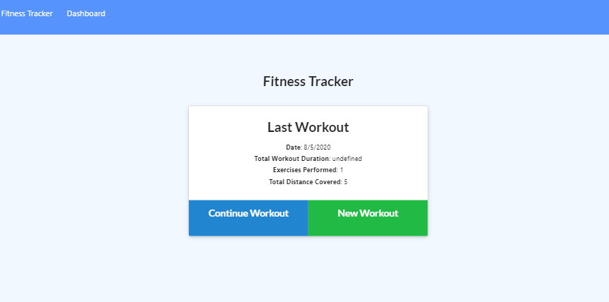
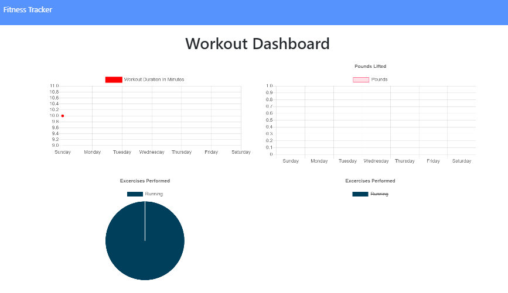

# Fitness Tracker (MongoDB and Node.js)

## Description

This fitness tracker utilizes MongoDB and Node.js to keep track of exercises and then display the stats over time.

## User Story

```
AS a user
I WANT to be able to view, create and track daily workouts. 
I WANT to be able to log multiple exercises in a workout on a given day. 
I WANT to track the name, type, weight, sets, reps, and duration of exercise. If the exercise is a cardio exercise, I should be able to track my distance traveled.
```


## Features

When the user loads the page, they should be given the option to create a new workout, or continue with their last workout.

The user should be able to:

  * Add exercises to a previous workout plan.

  * Add new exercises to a new workout plan.

  * View multiple the combined weight of multiple exercises on the `stats` page.

## Installation and Usage
To run on local device, git clone the repo and run npm install. Afterwards, make sure you have mongoDB properly installed and the seeder file should populate the database.

## Screenshots and Instructions

Main Default Screen where user can either continue work or add exercise


Stats for workouts

